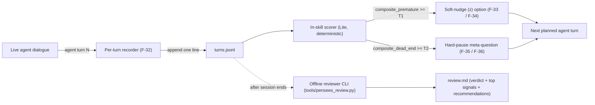

# Pensees v0.3.2 — Mid-Result Analysis Selection Plan (选型方案)

This document records the three design variants the team considered for the
v0.3.2 "mid-result analysis" layer, which detection mechanism shipped, and the
explicit triggers for revisiting the deferred two. Audience: Pensees operators
who want to know what the new guardrails actually do, and skill maintainers
who need to know which surface is forward-compatible. The doc stands alone:
every signal name, threshold, and schema field used below is defined in the
reference files cited under §8 and reproduced in the relevant section.

## 1. Problem statement

The seed prompt for v0.3.2 (recorded in
`.local/feedbacks/feedback_for_v0.3.2.md`) names two failure modes Pensees
sessions kept exhibiting in dogfood:

- **Premature detail** — the agent jumps to high-resolution multi-choice
  questions (`decision-matrix` / `forced-choice`) or repeated F-31 `(e)`
  detail probes on a single slot while sibling slots in the ontology are
  still `open`. The user gets pulled into the deep end of one branch before
  the option space is named.
- **Dead end** — the dialogue loops on one dimension (the same
  `ambiguity-tag: ...` 3+ turns in a row), forgets an `open` slot that hasn't
  been touched for several turns, or regresses convergence-checklist rows
  from `✅` back to `⚠️` / `❌`. The session has lost forward motion but
  nothing has paused the loop.

Both failure modes are made observable by deterministic functions of the
per-turn record stream. The seven base signals (three for premature-detail,
four for dead-end) plus the two clipped composite scores
`composite_premature` and `composite_dead_end` are defined in
`skill/references/composite-signals.md` §"Signal definitions" and
§"Composites". This selection plan reuses those names verbatim.

Out of scope for v0.3.2: any change to F-07 / F-08 / F-09 / F-10 / F-31 / the
HARD-GATE / write-path whitelist / session destruction protocol. The
mid-result layer adds new behavior (F-32..F-37) but never weakens existing
contracts.

## 2. Architecture (dual-layer)

The mid-result layer is split into two passes that share one data contract:

- **In-session pass** — runs at every agent turn. The per-turn recorder
  (F-32) emits one JSONL line to `<session_dir>/turns.jsonl` matching
  `skill/references/intermediate-result-schema.md`; the in-skill scorer
  derives the two composite scores from the last N records; the guardrail
  arms either a soft-nudge `(z)` option append (F-33 / F-34) or a hard-pause
  full-turn replacement (F-35 / F-36), capped at one injection per turn
  (F-37).
- **Offline pass** — runs after a session ends, on demand. The reviewer CLI
  at `tools/pensees_review.py` reads the same `turns.jsonl`, replays the
  signals deterministically, and writes `<session_dir>/review.md` from the
  template at `skill/templates/review-report.template.md`. The offline pass
  never edits the on-disk turn records and never re-runs the agent.

Both passes consume the same `turns.jsonl` so a session that is replayed
later derives identical scores to the live run, given identical thresholds
and weights. Per-session overrides live at `<session_dir>/.config.yaml`
under the top-level `mid_result_analysis:` key
(`composite-signals.md` §"Tuning hook").



Reference pointers:

- F-32..F-37 runtime contract: `skill/SKILL.md` §14.
- F-32..F-37 long-form behavior: `skill/references/mid-result-guardrails.md`.
- Per-turn record shape (13 Required Lite fields + 3 Reserved
  forward-compat fields): `skill/references/intermediate-result-schema.md`.
- Signal math, default thresholds (`T1 = T2 = 0.6`), tuning hook:
  `skill/references/composite-signals.md`.

## 3. Three variants compared

For each variant the bullets below list (a) the detection mechanism, (b) the
cost and latency profile per agent turn, (c) two or more concrete strengths,
(d) two or more concrete limits or blind spots, and (e) which schema fields
the variant populates. Only one variant — Lite — actually ships in v0.3.2;
Standard and Heavy are recorded here so the deferred work has the same
public footprint as the shipped work.

### 3.1 Lite (shipping in v0.3.2)

- **Detection mechanism.** Seven deterministic rule-based signals computed
  from the last N records in `turns.jsonl` plus `ontology.yaml`:
  `slot_focus_imbalance`, `e_probe_over_use`, `question_form_jump` (the
  premature-detail group); `amnesia`, `dimension_repetition`,
  `frame_collapse`, `checklist_regression` (the dead-end group). Each
  returns a float in `[0, 1]` and contributes `0` below its firing
  threshold. The two composites are clipped weighted sums; defaults
  weight each in-group signal at `1/group_size` and threshold both at
  `0.6`. Full pseudocode in `composite-signals.md` §"Signal definitions".
- **Cost / latency.** Zero extra LLM calls per turn. Scoring is pure
  arithmetic over the last few records plus an ontology scan; the
  worst-case per-turn cost is linear in the number of slots in
  `ontology.yaml` (capped at ~50 lines by F-10). No network egress, no
  API key, no model invocation. Runs identically on Lite, Standard, and
  Heavy hosts because the scorer lives entirely in the in-skill code path.
- **Strengths.**
  1. Deterministic and replayable. Re-running the offline reviewer on the
     same `turns.jsonl` with the same `.config.yaml` produces
     byte-identical `review.md`; this is asserted by the fixtures under
     `tests/fixtures/v032/{all_clean,premature_positive,dead_end_positive}/`.
  2. BYOCC-compatible. The skill holds no API keys (per the SKILL.md
     §0 trigger discipline and the AR-07 anti-requirement), so Lite never
     re-introduces an outbound call the rest of the package already
     forbids.
  3. Forward-compatible schema. Every Lite-emitted record reserves three
     forward-compat keys (`llm_judge`, `classifier_label`,
     `external_evidence`) so a future Standard or Heavy scorer can
     populate them without renaming any field or breaking the offline
     reviewer (`intermediate-result-schema.md` §"Reserved forward-compat
     fields").
- **Limits / blind spots.**
  1. Lite cannot detect *metaphorical* premature detail. A user asking
     "let's nail down the timeout for the leaky bucket" gets the same
     score whether `leaky bucket` is the right metaphor or a
     misapplication — the signals only see the slot name and the
     question form, not the semantic appropriateness.
  2. Lite cannot detect *novel* dead ends that don't fit one of the seven
     patterns. A session that loops by re-stating the same goal in
     different words (without repeating dimension, slot, or
     question_form) will not cross `composite_dead_end` even though a
     human reviewer would call it stuck.
  3. The thresholds are global per session, not adaptive. A
     `decision-matrix` question on turn 2 with zero filled aspects fires
     `question_form_jump` at `0.95` even when the user explicitly asked
     for one — Lite has no override channel inside the agent turn, only
     the per-session `.config.yaml` knob.
- **Schema fields used.** All 13 Required Lite fields
  (`schema_version`, `turn_id`, `timestamp`, `agent_or_user`, `dimension`,
  `preset`, `slots_touched`, `e_probe_target`, `question_form`,
  `ambiguity_tag`, `checklist_state`, `composite_premature`,
  `composite_dead_end`) plus the 3 Reserved forward-compat fields at
  their Lite defaults (`llm_judge: null`, `classifier_label: null`,
  `external_evidence: []`). Lite never populates the reserved trio.

### 3.2 Standard (deferred — offline LLM-judge)

- **Detection mechanism.** Same seven Lite signals computed identically,
  plus one LLM-as-judge pass over each agent turn (or batched every K
  turns) that returns a structured object — verdict, dimension, evidence
  quote, suggested next move — written into the `llm_judge` reserved
  field. The composites would gain an eighth signal `judge_verdict`
  whose weight is added to whichever group the judge identifies as the
  dominant failure mode.
- **Cost / latency.** Roughly one to three extra LLM calls per session
  (offline, batched), not per turn. Adds non-zero latency to the
  review.md generation step and requires whichever model the operator
  configures to be reachable. Standard does not run inside the live
  agent loop, so it never adds latency to a user-facing turn — it is a
  CI-style pass over the recorded `turns.jsonl`.
- **Strengths.**
  1. Catches the metaphorical premature-detail class that Lite misses,
     because the judge reads slot definitions, the verbatim user quotes
     in `transcript.md`, and the question wording rather than only the
     enum-valued fields the Lite signals consume.
  2. Provides per-turn evidence quotes that the offline reviewer can
     surface verbatim in §3 "Flagged Turns" of `review.md`, instead of
     the 80-character heuristic quote Lite uses today (see
     `truncate_quote` in `tools/pensees_review.py`).
- **Limits / blind spots.**
  1. Reintroduces an outbound LLM call, which conflicts with the AR-07
     "no inference API key" posture. Standard cannot ship until either
     the host agent's own loop owns the call (so Pensees still holds no
     key) or a sandboxed local-only model is wired in.
  2. Standard's judge verdicts are non-deterministic between runs, so
     the byte-equality fixture contract in
     `tests/fixtures/v032/**/review.md` would need to be replaced by a
     looser tolerance check (e.g. verdict matches, top-1 signal matches)
     or split into a separate test target.
- **Schema fields used.** Same 13 Required Lite fields, plus
  `llm_judge` populated with the structured judge output
  (`intermediate-result-schema.md` §"Reserved forward-compat fields"
  documents the `null` default and reserves the slot). `classifier_label`
  remains `null`. `external_evidence` carries citation quotes and the
  judge prompt-hash for audit.

### 3.3 Heavy (deferred — in-skill LLM introspection / fine-tuned classifier)

- **Detection mechanism.** Either a small fine-tuned classifier loaded
  inside the skill or a per-N-turns LLM introspection call that emits a
  single categorical label (`premature` / `dead_end` / `clean` / `other`)
  per evaluated turn, written into the `classifier_label` reserved
  field. Composites stay the Lite seven signals; the classifier label
  acts as an independent "second opinion" that the guardrail
  cross-references before arming.
- **Cost / latency.** Per-N-turns LLM call (default `N = 5` proposed in
  the v0.3.2 plan; finalized at the time Heavy ships) inside the live
  agent loop, adding noticeable per-turn latency on the turns the
  classifier fires. Model weights for the fine-tuned classifier add
  ~tens of MB to the install footprint; Pensees currently caps the
  bundle budget at 50 KB (NF-02 in `skill/SKILL.md` §12), so this
  variant requires either a bundle-budget exception or a runtime
  download path.
- **Strengths.**
  1. The classifier can fire on novel patterns that the seven Lite
     signals don't encode, because the training set defines failure
     classes by example rather than by hand-coded rule. Specifically,
     it can catch the "different-words-same-goal" loop that Lite §3.1
     limit #2 documents.
  2. Per-turn latency is bounded by the model size, not by the number
     of turns in the session, so very long sessions don't degrade
     guardrail responsiveness the way a batched offline judge would.
- **Limits / blind spots.**
  1. Requires either a fine-tuned model (training corpus, eval set,
     versioning pipeline — none of which exist in the v0.3.2 repo) or
     an in-skill LLM call (which has the same AR-07 conflict as
     Standard). Either path is at minimum a v0.3.x → v0.4.x scope bump.
  2. Classifier output is opaque to the offline reviewer's "Top
     contributing signals" table — a Heavy hit cannot be traced to a
     specific signal contribution the way `composite_premature = w1 *
     slot_focus_imbalance + w2 * e_probe_over_use + w3 *
     question_form_jump` can. The reviewer CLI would have to render
     classifier hits as a separate top-level section.
- **Schema fields used.** Same 13 Required Lite fields, plus
  `classifier_label` populated with the single label string
  (`intermediate-result-schema.md` reserves the slot). `llm_judge`
  remains `null` unless Standard is also running. `external_evidence`
  may carry the classifier's model-id / version hash for audit.

## 4. Recommendation

Lite ships in v0.3.2. Concrete reasons:

- **Deterministic.** Every signal in `composite-signals.md` is a pure
  function of the on-disk record stream; the fixture suite under
  `tests/fixtures/v032/` asserts byte-equal `review.md` output across
  re-runs.
- **BYOCC-compatible.** No API key, no outbound call, no host capability
  beyond what the rest of the skill already requires. The AR-07
  anti-requirement and the §8 write-path whitelist both stay green.
- **No new install footprint.** Lite reuses the existing `skill/` bundle
  plus `tools/pensees_review.py` (pure-stdlib + `pyyaml`); the install
  surface and the bundle-budget invariant (NF-02, 50 KB) are unchanged.
- **Patch-version scope.** v0.3.2 is a patch release in the v0.3.x line.
  Lite adds six new F-rules (F-32..F-37) and one CLI but does not break
  any existing F-rule or the HARD-GATE contract, so the change is
  minor-feature-on-patch — appropriate for v0.3.x.
- **Forward-compatible.** The three reserved schema keys
  (`llm_judge`, `classifier_label`, `external_evidence`) and the
  `schema_version: "0.3.2-lite"` sentinel let Standard and Heavy land
  later without renaming a single field or rewriting any historical
  record.

## 5. Deferred variants (when to reconsider)

Move from Lite to Standard or Heavy when at least one of these triggers
holds. The triggers are intentionally numeric / observable so the decision
is not driven by hand-wave.

- **Upgrade to Standard when:**
  - Measured precision of the Lite premature-detail composite drops below
    `0.70` on a hand-annotated dogfood corpus of at least 30 sessions
    (i.e. more than 30% of Lite-fired soft-nudge turns are judged
    false-positive by a human reviewer).
  - Operators repeatedly report a class of metaphorical premature-detail
    that Lite cannot see — the §3.1 limit #1 case — across at least two
    distinct sessions logged via `mcphub-skill-feedback` or an
    equivalent feedback channel.
  - The host agent surface gains a safe in-loop LLM-call primitive that
    the skill can consume without holding an API key (e.g. a host-side
    tool the skill can delegate to).
- **Upgrade to Heavy when:**
  - Lite's measured recall on dead-end loops drops below `0.60` on the
    same dogfood corpus, indicating that the seven fixed patterns no
    longer cover the failure space.
  - A maintained training corpus + eval split for the classifier exists
    in-repo or in a sibling repo with a documented update cadence, AND
    the install footprint cost of the model weights is explicitly
    budgeted (NF-02 exception).
  - The Standard variant has shipped and at least one quarter of
    real-world data shows residual failure modes that the LLM judge
    consistently misses but a labeled classifier can catch.

Until at least one trigger fires for a given variant, the deferred
variant stays deferred. Speculative work on Standard or Heavy is
explicitly out of scope for v0.3.x.

## 6. How to use

Lite runs automatically as long as the skill is installed at v0.3.2.
The two operator-visible surfaces are the in-session guardrails (the
`(z)` soft-nudge option and the `meta-pause` hard-pause turn) and the
offline reviewer CLI.

Generate a `review.md` from a completed session:

```bash
python3 tools/pensees_review.py <session_dir>
```

`<session_dir>` is the directory containing `turns.jsonl` — typically
`.local/pensees/{YYYY-MM-DD}-{slug}/`. On success the CLI prints

```
wrote <session_dir>/review.md (verdict=<v>, turns=<N>)
```

…and exits `0`. Exit codes `2..5` distinguish missing / empty / malformed
`turns.jsonl` and invalid `.config.yaml`; full table in
`tools/pensees_review.py` `parse_args` epilog.

Override the default thresholds and weights for a single session by
dropping a `.config.yaml` next to `turns.jsonl`:

```yaml
mid_result_analysis:
  premature:
    threshold: 0.55
    weights:
      slot_focus_imbalance: 0.40
      e_probe_over_use:     0.30
      question_form_jump:   0.30
  dead_end:
    threshold: 0.65
```

Partial overrides are allowed; any key you omit falls back to the
defaults in `composite-signals.md` §"Defaults". Per-composite weight
totals must remain within `[0.99, 1.01]`; any threshold must remain
within `[0.0, 1.0]`. Out-of-range or unknown-key overrides fail loudly
per AGENTS.md §"No Silent Failures" (exit code `5` in the CLI; startup
error in the live recorder once F-32 is wired into the agent loop).

## 7. Acceptance criteria summary

Lifted from the v0.3.2 plan; this list is the headline subset a
third-party reviewer can verify without reading the full plan.

- **Fixture-driven scoring.** The three fixtures
  `tests/fixtures/v032/{all_clean,premature_positive,dead_end_positive}/`
  produce a `review.md` whose verdict matches the directory name
  (`clean` / `flagged` or `high-friction` for the two positive cases),
  byte-equal between repeated runs.
- **Soft-nudge behavior.** When `composite_premature >= T1`, the agent's
  next multi-choice question gains exactly one extra option,
  `(z) 退一步, 这个问题是不是问错了`, appended after `(d)` and `(e)`.
  No other markup changes (F-34 boundary rules).
- **Hard-pause behavior.** When `composite_dead_end >= T2`, the agent's
  next turn is replaced by a meta-question with at most two substantive
  options plus `(d)`, and the planned domain question is re-attempted at
  turn `N+2` (F-35 / F-36).
- **Priority cap.** When both composites cross simultaneously, the
  hard-pause wins and the soft-nudge is suppressed for that turn
  (F-37). At most one guardrail-injected element per turn.
- **Tunability.** Operators can override thresholds and weights per
  session via `<session_dir>/.config.yaml` under the top-level
  `mid_result_analysis:` key. Out-of-range or unknown-key overrides
  cause a hard failure (exit `5` in the CLI), never silent fallback.
- **Repo-safety lint stays green.** `bash tests/lint-skill.sh` and
  `bash tests/lint-site.sh` pass after the v0.3.2 changes land; the
  v0.3.1-introduced `lint-repo-safety.sh` continues to pass
  unmodified.
- **Third-party-readable design surface.** This document and the three
  reference files cited in §8 together give a fresh reader enough
  context to identify the shipped variant, the deferred variants, and
  the trigger for each deferred variant — without consulting any file
  outside `docs/` and `skill/references/`.

## 8. References

- Per-turn record schema (13 Required + 3 Reserved fields):
  [`skill/references/intermediate-result-schema.md`](../skill/references/intermediate-result-schema.md).
- Composite signals, default thresholds, tuning hook, worked example:
  [`skill/references/composite-signals.md`](../skill/references/composite-signals.md).
- Mid-result guardrails (F-32..F-37 long-form):
  [`skill/references/mid-result-guardrails.md`](../skill/references/mid-result-guardrails.md).
- Runtime contract (F-32..F-37 single-line statements):
  [`skill/SKILL.md`](../skill/SKILL.md) §14.
- Offline reviewer CLI source + exit-code table:
  [`tools/pensees_review.py`](../tools/pensees_review.py).
- Review-report template (19 placeholders the CLI fills):
  [`skill/templates/review-report.template.md`](../skill/templates/review-report.template.md).
- Prior release plan (repo-safety / version-marker scope for v0.3.1):
  [`.cursor/plans/v0.3.1_repo_safety_23c943b4.plan.md`](../.cursor/plans/v0.3.1_repo_safety_23c943b4.plan.md).
- Seed prompt for v0.3.2:
  [`.local/feedbacks/feedback_for_v0.3.2.md`](../.local/feedbacks/feedback_for_v0.3.2.md).
